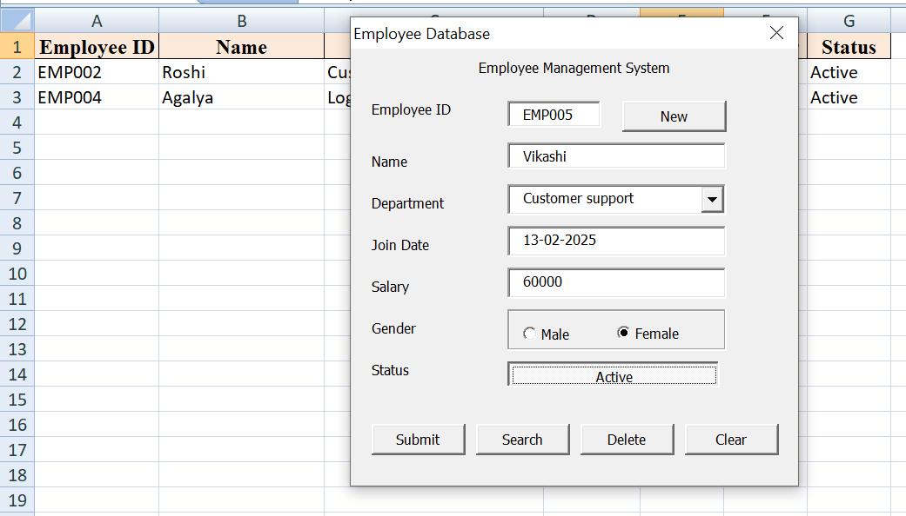
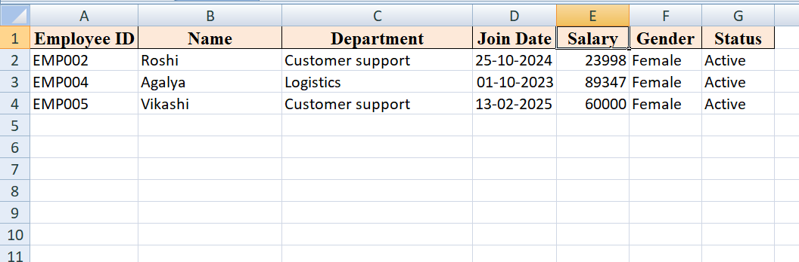

# Employee Management System (Excel VBA)

## Project Overview
- A complete Employee Management System built with Excel VBA and UserForms to add, search, delete, and manage employee records efficiently in an Excel worksheet.
- This project automates employee record management using a UserForm-based interface. Users can enter employee details, search existing records by Employee ID, delete records, clear the form, and create new entries.
- The system stores all data in a structured Excel table and updates records dynamically.

## Features

- Add new employee records
- Search employee details by Employee ID
- Delete existing records
- Generate a new record entry
- Clear all input fields
- Input validation
- Automatic data storage in Excel

## Employee Fields Captured

- Employee ID | Name | Department | Join Date | Salary | Gender | Status

## Tools Used

- Microsoft Excel
- VBA (Visual Basic for Applications)
- UserForms

## Project Structure

```
employee-management-system-vba/
│
├── Employee_Management_System.xlsm
│
├── code/
│   ├── UserForm.frm
│   └── UserForm.frx
│
├── screenshots/
│   ├── userform_filled.png
│   └── output.png
│
└── README.md
```
## Screenshots

### UserForm 


### Employee Records Stored in Excel


## How It Works

1. Open the Excel file and enable macros.
2. Launch the Employee Management UserForm.
3. Click **New** to start a new record.
4. Enter employee details.
5. Click **Submit** to save the record.
6. Use **Search** to retrieve employee details by Employee ID.
7. Use **Delete** to remove a record.
8. Click **Clear** to reset the form.

## How to Run the Project

1. Download `Employee_Management_System.xlsm`.
2. Open the file in Microsoft Excel.
3. Enable macros and open the UserForm.
4. Start managing employee records.
